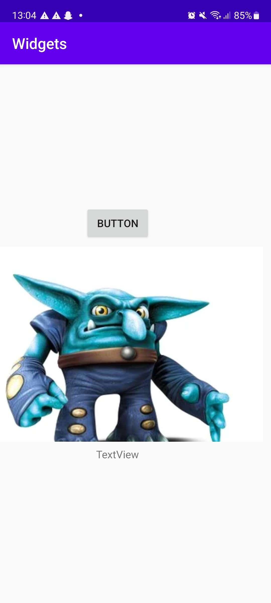

# Rapport

Jag har gjort en applikation med en ConstraintLayout där jag lade in en Button, ImageView och en TextView.
Jag satte constraints på de olika views och lade även in en egen bild i ImageViewn.

## Följande grundsyn gäller dugga-svar:

Koden nedan är XML gällande ImageViewn där den har ett ID, height och width är satta med wrap_content.
ImageViewn har olika constraints i alla fyra väderstreck. Bilden i viewn är även ändrad till egenvald bild.

```
<ImageView
        android:id="@+id/imageView"
        android:layout_width="wrap_content"
        android:layout_height="wrap_content"
        app:layout_constraintBottom_toTopOf="@+id/textView"
        app:layout_constraintEnd_toEndOf="parent"
        app:layout_constraintStart_toStartOf="parent"
        app:layout_constraintTop_toBottomOf="@+id/button"
        app:srcCompat="@drawable/lobgoblin"/>
```
